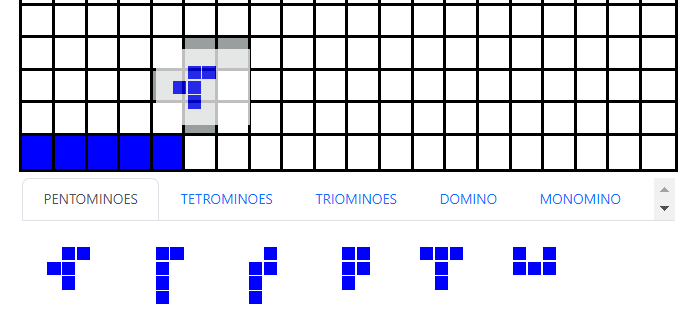

<a name="readme-top"></a>


<!-- PROJECT SHIELDS -->
<!--
*** I'm using markdown "reference style" links for readability.
*** Reference links are enclosed in brackets [ ] instead of parentheses ( ).
*** See the bottom of this document for the declaration of the reference variables
*** for contributors-url, forks-url, etc. This is an optional, concise syntax you may use.
*** https://www.markdownguide.org/basic-syntax/#reference-style-links
-->

<!-- [![Contributors][contributors-shield]][contributors-url]
[![Forks][forks-shield]][forks-url]
[![Stargazers][stars-shield]][stars-url]
[![Issues][issues-shield]][issues-url]
[![MIT License][license-shield]][license-url]
[![LinkedIn][linkedin-shield]][linkedin-url] -->


<!-- PROJECT LOGO -->
<br />
<div align="center">
  <a href="https://github.com/samlui96/react-blockus">
    
  </a>

  <h3 align="center">Blockus Simulation</h3>

  <p align="center">
    A project for practicing your BLOCKUS skills!
    <br />
    <!-- <a href="https://github.com/samlui96/react-blockus"><strong>Explore the docs »</strong></a>
    <br />
    <br />
    <a href="https://github.com/samlui96/react-blockus">View Demo</a>
    ·
    <a href="https://github.com/samlui96/react-blockus/issues">Report Bug</a>
    ·
    <a href="https://github.com/samlui96/react-blockus/issues">Request Feature</a> -->
  </p>
</div>


<!-- TABLE OF CONTENTS -->
<details>
  <summary>Table of Contents</summary>
  <ol>
    <li>
      <a href="#about-the-project">About The Project</a>
      <ul>
        <li><a href="#built-with">Built With</a></li>
      </ul>
    </li>
    <li>
      <a href="#getting-started">Getting Started</a>
      <ul>
        <li><a href="#prerequisites">Prerequisites</a></li>
        <li><a href="#installation">Installation</a></li>
      </ul>
    </li>
    <li><a href="#usage">Usage</a></li>
    <li><a href="#roadmap">Roadmap</a></li>
    <li><a href="#contributing">Contributing</a></li>
    <li><a href="#license">License</a></li>
    <li><a href="#contact">Contact</a></li>
    <li><a href="#acknowledgments">Acknowledgments</a></li>
  </ol>
</details>


<!-- ABOUT THE PROJECT -->
## About The Project

<!-- [![Product Name Screen Shot][product-screenshot]](https://example.com) -->
[![Blokus Screen Shot][product-screenshot]]([product-screenshot])

The project is to simulate the board game called _Blokus_. Blokus is played on 20x20 board and 84 game tiles (4 set of 21 shapes tiles with diffenet colors). The objective is to place all your tiles and survive as long as possible.

The satdnard rules of the game are as follow:

* Order of play is based on the color of pieces: blue, yellow, red, green.
* The first piece played of each color is placed in one of the board's four corners. Each new piece played must be placed so that it touches at least one piece of the same color, with only corner-to-corner contact allowed — edges cannot touch. Edge-to-edge contact between pieces of different colors, however, is allowed.
* When a player cannot place a piece, they pass, and play continues as normal. The game ends when no one can place any more pieces

Once the game ends, each player counts every square on the piece(s) that they did NOT place on the board, each counting as a negative (−1) point (e.g. an unplayed tetromino is worth −4 points). A player who played all of their pieces is awarded a 15-point bonus. If the last piece played was a monomino, provided that all pieces of own color have been played, the player is awarded a 20-point bonus instead. The player with the highest score wins.

The project is made by React.js and is still on development. The current state is on _State 1_. To read more, please go to _Roadmap_ section.

<p align="right">(<a href="#readme-top">back to top</a>)</p>


### Built With

<!-- This section should list any major frameworks/libraries used to bootstrap your project. Leave any add-ons/plugins for the acknowledgements section. Here are a few examples. -->

<!-- * [![Next][Next.js]][Next-url] -->
* [![React][React.js]][React-url]
<!-- * [![Vue][Vue.js]][Vue-url] -->
<!-- * [![Angular][Angular.io]][Angular-url]
* [![Svelte][Svelte.dev]][Svelte-url] -->
<!-- * [![Laravel][Laravel.com]][Laravel-url] -->
* [![Bootstrap][Bootstrap.com]][Bootstrap-url]
<!-- * [![JQuery][JQuery.com]][JQuery-url] -->

<p align="right">(<a href="#readme-top">back to top</a>)</p>


<!-- GETTING STARTED -->
## Getting Started

<!-- This is an example of how you may give instructions on setting up your project locally.
To get a local copy up and running follow these simple example steps.

### Prerequisites

This is an example of how to list things you need to use the software and how to install them.
* npm
  ```sh
  npm install npm@latest -g
  ``` -->

### Installation

_Below is an example of how you can instruct your audience on installing and setting up your app. This template doesn't rely on any external dependencies or services._

<!-- 1. Get a free API Key at [https://example.com](https://example.com)
2. Clone the repo
   ```sh
   git clone https://github.com/your_username_/Project-Name.git
   ```
3. Install NPM packages
   ```sh
   npm install
   ```
4. Enter your API in `config.js`
   ```js
   const API_KEY = 'ENTER YOUR API';
   ``` -->

1. Clone the repo
   ```sh
   git clone https://github.com/samlui96/react-blockus.git
   ```
2. Install NPM packages
   ```sh
   npm install
   ```
<!-- 4. Enter your API in `config.js`
   ```js
   const API_KEY = 'ENTER YOUR API';
   ``` -->

<p align="right">(<a href="#readme-top">back to top</a>)</p>


<!-- USAGE EXAMPLES -->
## Usage

To begin with, right click any tile as starting point. It is temporary function and is for test purpose.
<br />

<a href="https://github.com/samlui96/react-blockus">
  
</a>

<br />
Drag the target and drop it to the board. The color will be changed on time. Red color means it is invalid dropping place and Grey color means it is valid dropping place.
<br />

<a href="https://github.com/samlui96/react-blockus">
    
</a>

<br />
Click the same place where it dropped to confirm the move. (preventing the dropping mistakes.)
<br />

<a href="https://github.com/samlui96/react-blockus">
    
</a>

<br />
Blue color implies the move is compelete.
<br />

<a href="https://github.com/samlui96/react-blockus">
    
</a>

<br />
Click the Tap section to change the tile group.
<br />

<a href="https://github.com/samlui96/react-blockus">
    
</a>

<br />
<!-- _For more examples, please refer to the [Documentation](https://example.com)_ -->

<p align="right">(<a href="#readme-top">back to top</a>)</p>


<!-- ROADMAP -->
## Roadmap

State 1: Offline Version
- [x] Create Blockus Template
- [ ] Add Multiple Player Function (offline)
- [ ] Add Differnet Pages for ease to use
    - [ ] Main Page
    - [ ] Introduction page
    - [ ] Game Page
- [ ] UI/UX Enhancement
- [ ] Add related documents
State 2: Online Version
State 3: Mobile Version

See the [open issues](https://github.com/samlui96/react-blockus/issues) for a full list of proposed features (and known issues).

<p align="right">(<a href="#readme-top">back to top</a>)</p>


<!-- CONTRIBUTING -->
## Contributing

Contributions are what make the open source community such an amazing place to learn, inspire, and create. Any contributions you make are **greatly appreciated**.

If you have a suggestion that would make this better, please fork the repo and create a pull request. You can also simply open an issue with the tag "enhancement".
Don't forget to give the project a star! Thanks again!

1. Fork the Project
2. Create your Feature Branch (`git checkout -b YOUR_BRANCH_NAME origin/DEV`)
3. Add your Change (`git add --all`)
4. Commit your Changes (`git commit -m 'Add some AmazingFeature'`)
5. Push to the Branch (`git push origin YOUR_BRANCH_NAME:YOUR_BRANCH_NAME`)
6. Open a Pull Request

<p align="right">(<a href="#readme-top">back to top</a>)</p>


<!-- LICENSE -->
## License

License will be uploaded soon.
<!-- Distributed under the MIT License. See `LICENSE.txt` for more information. -->

<p align="right">(<a href="#readme-top">back to top</a>)</p>


<!-- CONTACT -->
## Contact

[Sam Lui](https://www.linkedin.com/in/paksumlui/) - luipaksum@hotmail.com

Project Link: [https://github.com/samlui96/react-blockus](https://github.com/samlui96/react-blockus)

<p align="right">(<a href="#readme-top">back to top</a>)</p>


<!-- ACKNOWLEDGMENTS -->
## Acknowledgments

Use this space to list resources you find helpful and would like to give credit to. I've included a few of my favorites to kick things off!

* [GitHub Pages](https://pages.github.com)
* [React Redux](https://react-redux.js.org/)
* [JSS integration with React](https://cssinjs.org/react-jss/?v=v10.9.2)
* [React Bootstrap](https://react-bootstrap.github.io/)
* [Drag And Drop](https://github.com/asatraitis/react-hooks-dragndrop)
* [Blokus](https://web.archive.org/web/20071227074218/http://www.blokus.com/en/regles_plateau.html)

<p align="right">(<a href="#readme-top">back to top</a>)</p>


<!-- MARKDOWN LINKS & IMAGES -->
<!-- https://www.markdownguide.org/basic-syntax/#reference-style-links -->
[contributors-shield]: https://img.shields.io/github/contributors/samlui96/react-blockus.svg?style=for-the-badge
[contributors-url]: https://github.com/samlui96/react-blockus/graphs/contributors
[forks-shield]: https://img.shields.io/github/forks/samlui96/react-blockus.svg?style=for-the-badge
[forks-url]: https://github.com/samlui96/react-blockus/network/members
[stars-shield]: https://img.shields.io/github/stars/samlui96/react-blockus.svg?style=for-the-badge
[stars-url]: https://github.com/samlui96/react-blockus/stargazers
[issues-shield]: https://img.shields.io/github/issues/samlui96/react-blockus.svg?style=for-the-badge
[issues-url]: https://github.com/samlui96/react-blockus/issues
[license-shield]: https://img.shields.io/github/license/samlui96/react-blockus.svg?style=for-the-badge
[license-url]: https://github.com/samlui96/react-blockus/blob/master/LICENSE.txt
[linkedin-shield]: https://img.shields.io/badge/-LinkedIn-black.svg?style=for-the-badge&logo=linkedin&colorB=555
[linkedin-url]: https://linkedin.com/in/samlui96
[product-screenshot]: images/screenshot.png
[product-usage0]: images/usage0.png
[product-usage1]: images/usage1.png
[product-usage2]: images/usage2.png
[product-usage3]: images/usage3.png
[product-usage4]: images/usage4.png
[Next.js]: https://img.shields.io/badge/next.js-000000?style=for-the-badge&logo=nextdotjs&logoColor=white
[Next-url]: https://nextjs.org/
[React.js]: https://img.shields.io/badge/React-20232A?style=for-the-badge&logo=react&logoColor=61DAFB
[React-url]: https://reactjs.org/
[Vue.js]: https://img.shields.io/badge/Vue.js-35495E?style=for-the-badge&logo=vuedotjs&logoColor=4FC08D
[Vue-url]: https://vuejs.org/
[Angular.io]: https://img.shields.io/badge/Angular-DD0031?style=for-the-badge&logo=angular&logoColor=white
[Angular-url]: https://angular.io/
[Svelte.dev]: https://img.shields.io/badge/Svelte-4A4A55?style=for-the-badge&logo=svelte&logoColor=FF3E00
[Svelte-url]: https://svelte.dev/
[Laravel.com]: https://img.shields.io/badge/Laravel-FF2D20?style=for-the-badge&logo=laravel&logoColor=white
[Laravel-url]: https://laravel.com
[Bootstrap.com]: https://img.shields.io/badge/Bootstrap-563D7C?style=for-the-badge&logo=bootstrap&logoColor=white
[Bootstrap-url]: https://getbootstrap.com
[JQuery.com]: https://img.shields.io/badge/jQuery-0769AD?style=for-the-badge&logo=jquery&logoColor=white
[JQuery-url]: https://jquery.com 